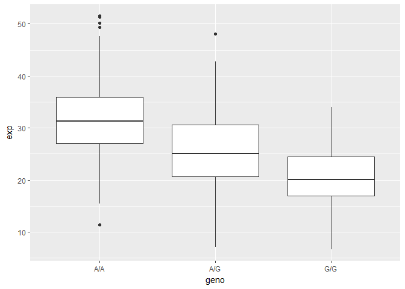

## Genomics Work

Question 1: 4 Candidate SNPS from OMIM: 
  rs12936231 
  rs8067378 
  rs9303277
  rs7216389

Question 2: 
  ORMDL3
  ZPBP2
  IKZF3
  GSDMB 
  
Question 3: Location is Chromosome 17:39895095 (forward strand)|VCF:17

Question 4: GSDMB, LRRC3C, GSDMA


```r
geno <- read.csv("Genotypes.csv", header = TRUE)

num <- grep("G|G", geno$Genotype..forward.strand.)

print(num)
```

```
##  [1]  2  4  5  6  7  9 11 14 16 17 18 19 20 21 22 23 24 25 26 29 31 32 33
## [24] 37 38 39 40 42 43 44 45 48 51 52 54 56 57 59 60 61 63 64
```

```r
genosummary <- table(geno$Genotype..forward.strand.)

proportion <- genosummary / nrow(geno) * 100

proportion
```

```
## 
##     A|A     A|G     G|A     G|G 
## 34.3750 32.8125 18.7500 14.0625
```


Question 5: 9 out of the 64 people studied so 14%

Question 6: For same HG00109, the phenotype is G|G


```r
#install.packages("seqinr")
#install.packages("gtools")
#library(seqinr)
#library(gtools)
```


```r
library(seqinr)
library(gtools)

phred <- asc(s2c("DDDDCDEDCDDDDBBDDDCC@")) - 33

phred
```

```
##  D  D  D  D  C  D  E  D  C  D  D  D  D  B  B  D  D  D  C  C  @ 
## 35 35 35 35 34 35 36 35 34 35 35 35 35 33 33 35 35 35 34 34 31
```

```r
prob <- 10**(-phred/10)

prob
```

```
##            D            D            D            D            C 
## 0.0003162278 0.0003162278 0.0003162278 0.0003162278 0.0003981072 
##            D            E            D            C            D 
## 0.0003162278 0.0002511886 0.0003162278 0.0003981072 0.0003162278 
##            D            D            D            B            B 
## 0.0003162278 0.0003162278 0.0003162278 0.0005011872 0.0005011872 
##            D            D            D            C            C 
## 0.0003162278 0.0003162278 0.0003162278 0.0003981072 0.0003981072 
##            @ 
## 0.0007943282
```


Section 4

Extracting data and plotting

```r
genedata <- read.table("Genotyping.txt", header = TRUE)

boxplot(genedata)
```

<!-- -->

```r
summary(genedata)
```

```
##      sample     geno          exp        
##  HG00096:  1   A/A:108   Min.   : 6.675  
##  HG00097:  1   A/G:233   1st Qu.:20.004  
##  HG00099:  1   G/G:121   Median :25.116  
##  HG00100:  1             Mean   :25.640  
##  HG00101:  1             3rd Qu.:30.779  
##  HG00102:  1             Max.   :51.518  
##  (Other):456
```


Number of samples

```r
nrow(genedata)
```

```
## [1] 462
```


Sample size for each genotype 

```r
genedata2 <- table(genedata$geno)

genedata2
```

```
## 
## A/A A/G G/G 
## 108 233 121
```

Different genotype levels


```r
summary(genedata$geno[(genedata$geno == "A/A")])
```

```
## A/A A/G G/G 
## 108   0   0
```

```r
summary(genedata$geno[(genedata$geno == "A/G")])
```

```
## A/A A/G G/G 
##   0 233   0
```

```r
summary(genedata$geno[(genedata$geno == "G/G")])
```

```
## A/A A/G G/G 
##   0   0 121
```


Boxplot


```r
boxplot(exp ~ geno, data = genedata, notch = TRUE, outline = TRUE)
```

<!-- -->

A nicer ggplot version


```r
library(ggplot2)
ggplot(genedata, aes(geno, exp)) + geom_boxplot()
```

<!-- -->


```r
ggplot(genedata, aes(exp, fill = geno)) + geom_density(alpha = 0.6)
```

<!-- -->

