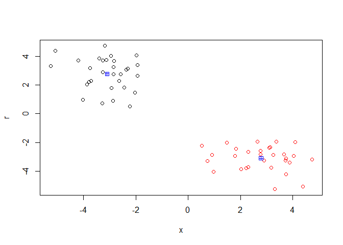
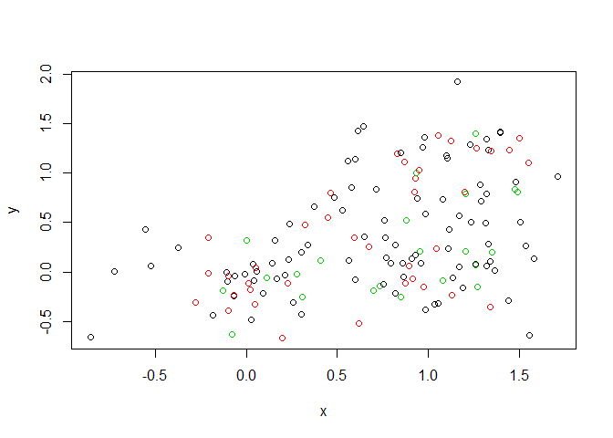
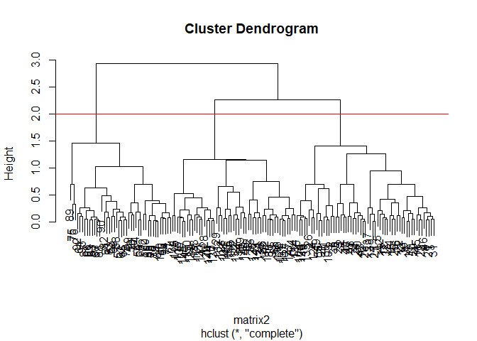
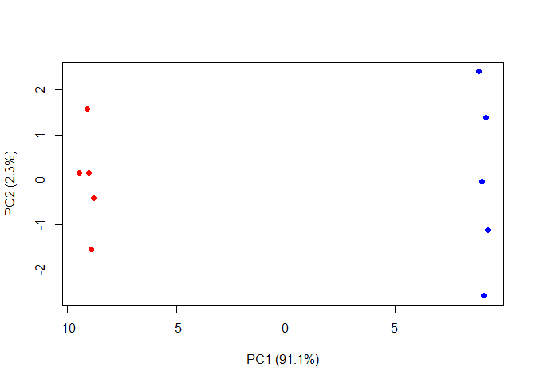

## Machine Learning with kmeans

Setting up some data  


```r
tmp <- c(rnorm(30, -3), rnorm(30,3))
x <- cbind (x = tmp, r = rev(tmp))

plot(x)
```

<!-- -->

Using the kmeans() function 


```r
km <- kmeans(x, centers = 2, nstart = 20)
km
```

```
## K-means clustering with 2 clusters of sizes 30, 30
## 
## Cluster means:
##           x         r
## 1 -3.100518  2.781265
## 2  2.781265 -3.100518
## 
## Clustering vector:
##  [1] 1 1 1 1 1 1 1 1 1 1 1 1 1 1 1 1 1 1 1 1 1 1 1 1 1 1 1 1 1 1 2 2 2 2 2
## [36] 2 2 2 2 2 2 2 2 2 2 2 2 2 2 2 2 2 2 2 2 2 2 2 2 2
## 
## Within cluster sum of squares by cluster:
## [1] 57.51941 57.51941
##  (between_SS / total_SS =  90.0 %)
## 
## Available components:
## 
## [1] "cluster"      "centers"      "totss"        "withinss"    
## [5] "tot.withinss" "betweenss"    "size"         "iter"        
## [9] "ifault"
```

Analyzing km 


```r
km$cluster
```

```
##  [1] 1 1 1 1 1 1 1 1 1 1 1 1 1 1 1 1 1 1 1 1 1 1 1 1 1 1 1 1 1 1 2 2 2 2 2
## [36] 2 2 2 2 2 2 2 2 2 2 2 2 2 2 2 2 2 2 2 2 2 2 2 2 2
```

```r
km$size
```

```
## [1] 30 30
```

```r
km$centers
```

```
##           x         r
## 1 -3.100518  2.781265
## 2  2.781265 -3.100518
```

Plotting it 


```r
plot(x, col = km$cluster)
points(km$centers, col = "Blue", pch = 12)
```

<!-- -->

Doing it with k = 3


```r
km2 <- kmeans(x, centers = 3, nstart = 20)
km2 
```

```
## K-means clustering with 3 clusters of sizes 30, 11, 19
## 
## Cluster means:
##           x         r
## 1 -3.100518  2.781265
## 2  1.551658 -3.079005
## 3  3.493144 -3.112974
## 
## Clustering vector:
##  [1] 1 1 1 1 1 1 1 1 1 1 1 1 1 1 1 1 1 1 1 1 1 1 1 1 1 1 1 1 1 1 3 3 3 3 3
## [36] 3 2 3 3 3 2 3 2 2 3 3 2 3 2 2 3 3 3 2 3 2 3 2 2 3
## 
## Within cluster sum of squares by cluster:
## [1] 57.51941  9.34897 21.90247
##  (between_SS / total_SS =  92.3 %)
## 
## Available components:
## 
## [1] "cluster"      "centers"      "totss"        "withinss"    
## [5] "tot.withinss" "betweenss"    "size"         "iter"        
## [9] "ifault"
```

Analyzing km3


```r
km2$cluster
```

```
##  [1] 1 1 1 1 1 1 1 1 1 1 1 1 1 1 1 1 1 1 1 1 1 1 1 1 1 1 1 1 1 1 3 3 3 3 3
## [36] 3 2 3 3 3 2 3 2 2 3 3 2 3 2 2 3 3 3 2 3 2 3 2 2 3
```

```r
km$size
```

```
## [1] 30 30
```

```r
km$centers
```

```
##           x         r
## 1 -3.100518  2.781265
## 2  2.781265 -3.100518
```
Plotting it


```r
plot(x, col = km2$cluster)
points(km$centers, col = "Blue", pch = 12)
```

<!-- -->


## Machine Learning with Hierarchical clustering model  

Coding it: 


```r
dist_matrix <- dist(x)

#dist_matrix

hc <- hclust (d = dist_matrix)
```

Now looking at the distance matrix 


```r
class(dist_matrix)
```

```
## [1] "dist"
```


Looking at it 

```r
View(as.matrix(dist_matrix))
dim(as.matrix(dist_matrix))
```

```
## [1] 60 60
```


```r
plot(hc)
abline(h = 4, col = "red")
```

<!-- -->

```r
cutree(hc, k = 6)
```

```
##  [1] 1 2 2 1 2 1 2 1 3 1 2 2 3 2 1 1 2 2 1 2 3 3 1 2 1 1 1 1 1 1 4 4 4 4 4
## [36] 4 5 4 6 6 5 4 5 5 4 4 5 6 5 5 4 6 4 5 4 5 4 5 5 4
```


```r
plot(x, col = cutree(hc, k = 5))
points(km2$centers, col = "blue", pch = 12)
```

<!-- -->

```r
print(km2$centers)
```

```
##           x         r
## 1 -3.100518  2.781265
## 2  1.551658 -3.079005
## 3  3.493144 -3.112974
```

Different clusters: 


```r
#hc.complete <- hclust(x, method = "complete")
```


```r
x <- rbind(
  matrix(rnorm(100, mean = 0, sd = 0.3), ncol = 2),
  matrix(rnorm(100, mean = 1, sd = 0.3), ncol = 2),
  matrix(c(rnorm(50, mean = 1, sd = 0.3),
          rnorm(50, mean = 0, sd = 0.3)), ncol = 2))

colnames(x) <- c("x", "y")

plot(x)
```

<!-- -->

```r
col <- as.factor(rep(c("c1", "c2", "c3"), each = 50))

plot(x, col = col)
```

<!-- -->

```r
plot (x, col=cutree(hc, k = 3))
```

<!-- -->


```r
x <- rbind(
  matrix(rnorm(100, mean = 0, sd = 0.3), ncol = 2),
  matrix(rnorm(100, mean = 1, sd = 0.3), ncol = 2),
  matrix(c(rnorm(50, mean = 1, sd = 0.3),
          rnorm(50, mean = 0, sd = 0.3)), ncol = 2))


matrix2 <- dist(x)

hc2 <- hclust (d = matrix2)

plot(hc2)

abline(h = 2, col = "red")
```

<!-- -->

```r
cutree(hc2, k = 3)
```

```
##   [1] 1 1 1 1 1 1 1 1 1 1 1 1 1 1 1 1 1 1 1 2 1 1 1 1 1 1 1 1 1 1 1 1 1 2 1
##  [36] 1 1 1 1 1 1 1 1 1 1 1 1 1 1 1 3 2 3 3 1 2 3 3 3 3 3 3 3 3 3 3 3 2 3 3
##  [71] 3 3 3 3 3 3 3 3 3 2 3 3 3 3 3 2 3 3 3 3 1 3 2 2 3 3 3 3 3 3 2 2 1 1 2
## [106] 2 2 2 2 2 2 2 2 2 2 2 2 2 1 1 2 2 2 1 2 2 2 2 2 3 2 2 2 2 1 2 2 2 2 2
## [141] 2 2 2 2 2 1 2 2 2 2
```

```r
plot(x, col = cutree(hc2, k = 3))
```

<!-- -->

## PCA time 


```r
mydata <- matrix(nrow = 100, ncol = 10)
rownames(mydata) <- paste("gene", 1:100, sep = "")
colnames(mydata) <- c(paste("wt", 1:5, sep = ""),
                      paste("ko", 1:5, sep = ""))
for (i in 1:nrow(mydata)) {
  wt.values <- rpois(5, lambda = sample(x = 10:1000, size = 1))
  ko.values <- rpois(5, lambda = sample(x = 10:1000, size = 1))
  
  mydata[i, ] <- c(wt.values, ko.values)
  
}

head(mydata)
```

```
##        wt1  wt2 wt3 wt4 wt5 ko1 ko2 ko3 ko4 ko5
## gene1  602  600 618 594 630 322 325 338 339 297
## gene2   10    6  12  10  10 220 214 191 210 217
## gene3  492  467 508 483 524 516 525 508 513 515
## gene4 1056 1032 970 997 940  13  21  17  10  22
## gene5  179  236 206 216 196 355 332 325 359 343
## gene6  937  969 952 967 948 576 568 567 593 554
```

```r
pca <- prcomp(t(mydata), scale = TRUE)

attributes(pca)
```

```
## $names
## [1] "sdev"     "rotation" "center"   "scale"    "x"       
## 
## $class
## [1] "prcomp"
```

```r
plot(pca$x[ ,1], pca$x [ ,2])
```

<!-- -->

```r
pca.var <- pca$sdev^2

pca.var.per <- round(pca.var/sum(pca.var) * 100, 1)

pca.var.per
```

```
##  [1] 91.1  2.3  1.6  1.4  1.1  0.8  0.7  0.6  0.4  0.0
```

```r
barplot(pca.var.per, main = "Scree Plot", 
        xlab = "Principal Component", ylab = "Percent Variation")
```

<!-- -->

```r
colvec <- colnames(mydata)
colvec[grep("wt", colvec)] <- "red"
colvec[grep("ko", colvec)] <- "blue"


plot(pca$x[ ,1], pca$x[ ,2], col = colvec, pch = 16,
     xlab = paste0("PC1 (", pca.var.per[1], "%)"),
     ylab = paste0("PC2 (", pca.var.per[2], "%)"))
```

<!-- -->

```r
# run in console to identify points:
# identify(pca$x[ ,1], pca$x[ ,2], labels = colnames(mydata))
```


