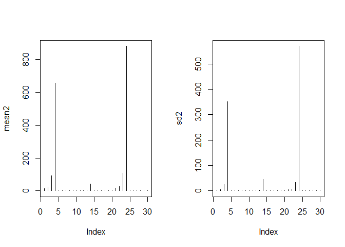
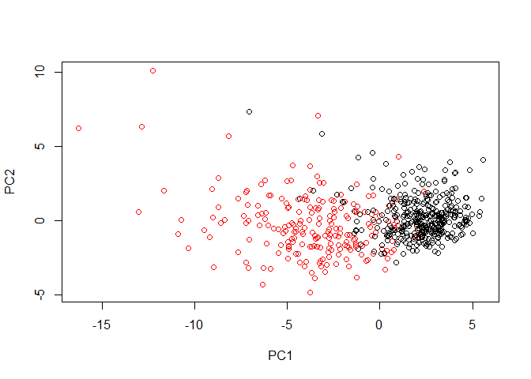
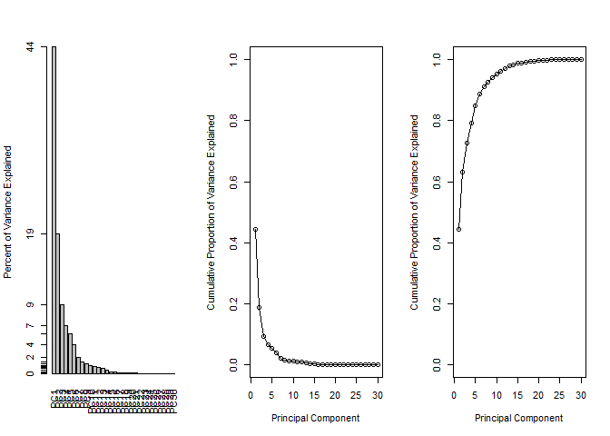
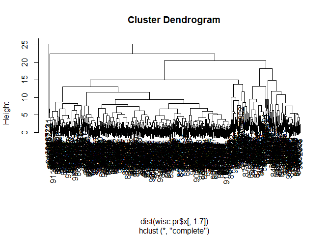

## Cancer Cell Work and Plots!

Importing data and rearranging the B and M conditions to Boolean 


```r
wisc.df <- read.csv("WisconsinCancer.csv", head = TRUE)

View(wisc.df)

wisc.data <- as.matrix(wisc.df[ ,3:32])

row.names(wisc.data) <- wisc.df$id

diagnosis <- as.numeric(wisc.df$diagnosis == "M")

table(diagnosis)
```

```
## diagnosis
##   0   1 
## 357 212
```

```r
table(wisc.df$diagnosis)
```

```
## 
##   B   M 
## 357 212
```

# Q1: How many observations are in this data set? 


```r
row <- nrow(wisc.df)
column <- ncol(wisc.df)

row 
```

```
## [1] 569
```

```r
column
```

```
## [1] 33
```

```r
total <- row * column

total 
```

```
## [1] 18777
```
There are 569 observations in this data set (569 rows, 33 columns)


# Q2: How many variables/features in the data are suffixed with _mean?


```r
# The column names are not counted as the data, have to specify that you want to 
# search them
z <- colnames(wisc.data)
grep("_mean", z, value = TRUE)
```

```
##  [1] "radius_mean"            "texture_mean"          
##  [3] "perimeter_mean"         "area_mean"             
##  [5] "smoothness_mean"        "compactness_mean"      
##  [7] "concavity_mean"         "concave.points_mean"   
##  [9] "symmetry_mean"          "fractal_dimension_mean"
```

There are 10 variables in the data suffixed with _mean


# Q3: How many of the observations have a malignant diagnosis? 


```r
sum(diagnosis)
```

```
## [1] 212
```

There are 212 Malignant cases 

# Checking the mean and standard deviation of the features 


```r
colMeans(wisc.data)
```

```
##             radius_mean            texture_mean          perimeter_mean 
##            1.412729e+01            1.928965e+01            9.196903e+01 
##               area_mean         smoothness_mean        compactness_mean 
##            6.548891e+02            9.636028e-02            1.043410e-01 
##          concavity_mean     concave.points_mean           symmetry_mean 
##            8.879932e-02            4.891915e-02            1.811619e-01 
##  fractal_dimension_mean               radius_se              texture_se 
##            6.279761e-02            4.051721e-01            1.216853e+00 
##            perimeter_se                 area_se           smoothness_se 
##            2.866059e+00            4.033708e+01            7.040979e-03 
##          compactness_se            concavity_se       concave.points_se 
##            2.547814e-02            3.189372e-02            1.179614e-02 
##             symmetry_se    fractal_dimension_se            radius_worst 
##            2.054230e-02            3.794904e-03            1.626919e+01 
##           texture_worst         perimeter_worst              area_worst 
##            2.567722e+01            1.072612e+02            8.805831e+02 
##        smoothness_worst       compactness_worst         concavity_worst 
##            1.323686e-01            2.542650e-01            2.721885e-01 
##    concave.points_worst          symmetry_worst fractal_dimension_worst 
##            1.146062e-01            2.900756e-01            8.394582e-02
```

```r
apply(wisc.data, 2, sd)
```

```
##             radius_mean            texture_mean          perimeter_mean 
##            3.524049e+00            4.301036e+00            2.429898e+01 
##               area_mean         smoothness_mean        compactness_mean 
##            3.519141e+02            1.406413e-02            5.281276e-02 
##          concavity_mean     concave.points_mean           symmetry_mean 
##            7.971981e-02            3.880284e-02            2.741428e-02 
##  fractal_dimension_mean               radius_se              texture_se 
##            7.060363e-03            2.773127e-01            5.516484e-01 
##            perimeter_se                 area_se           smoothness_se 
##            2.021855e+00            4.549101e+01            3.002518e-03 
##          compactness_se            concavity_se       concave.points_se 
##            1.790818e-02            3.018606e-02            6.170285e-03 
##             symmetry_se    fractal_dimension_se            radius_worst 
##            8.266372e-03            2.646071e-03            4.833242e+00 
##           texture_worst         perimeter_worst              area_worst 
##            6.146258e+00            3.360254e+01            5.693570e+02 
##        smoothness_worst       compactness_worst         concavity_worst 
##            2.283243e-02            1.573365e-01            2.086243e-01 
##    concave.points_worst          symmetry_worst fractal_dimension_worst 
##            6.573234e-02            6.186747e-02            1.806127e-02
```

# Plotting mean and Standard Deviation 


```r
mean2 <- colMeans(wisc.data)

sd2 <- apply(wisc.data, 2, sd)

par(mfrow = c(1,2))

plot(mean2, type = "h")

plot(sd2, type = "h")
```

<!-- -->


# Using PCA now 


```r
x <- scale(wisc.data, scale = TRUE)

wisc.pr <- prcomp(x)

summary(wisc.pr)
```

```
## Importance of components:
##                           PC1    PC2     PC3     PC4     PC5     PC6
## Standard deviation     3.6444 2.3857 1.67867 1.40735 1.28403 1.09880
## Proportion of Variance 0.4427 0.1897 0.09393 0.06602 0.05496 0.04025
## Cumulative Proportion  0.4427 0.6324 0.72636 0.79239 0.84734 0.88759
##                            PC7     PC8    PC9    PC10   PC11    PC12
## Standard deviation     0.82172 0.69037 0.6457 0.59219 0.5421 0.51104
## Proportion of Variance 0.02251 0.01589 0.0139 0.01169 0.0098 0.00871
## Cumulative Proportion  0.91010 0.92598 0.9399 0.95157 0.9614 0.97007
##                           PC13    PC14    PC15    PC16    PC17    PC18
## Standard deviation     0.49128 0.39624 0.30681 0.28260 0.24372 0.22939
## Proportion of Variance 0.00805 0.00523 0.00314 0.00266 0.00198 0.00175
## Cumulative Proportion  0.97812 0.98335 0.98649 0.98915 0.99113 0.99288
##                           PC19    PC20   PC21    PC22    PC23   PC24
## Standard deviation     0.22244 0.17652 0.1731 0.16565 0.15602 0.1344
## Proportion of Variance 0.00165 0.00104 0.0010 0.00091 0.00081 0.0006
## Cumulative Proportion  0.99453 0.99557 0.9966 0.99749 0.99830 0.9989
##                           PC25    PC26    PC27    PC28    PC29    PC30
## Standard deviation     0.12442 0.09043 0.08307 0.03987 0.02736 0.01153
## Proportion of Variance 0.00052 0.00027 0.00023 0.00005 0.00002 0.00000
## Cumulative Proportion  0.99942 0.99969 0.99992 0.99997 1.00000 1.00000
```


# Q4: From results, what proportion of the original variance is captured by the first principal components (PC1) ?

44.27%

# Q5: How many principal components (PCs) are required to describe at least 70% of the original variance in the data? 


```r
sum(44.27 + 18.97 + 9.4)
```

```
## [1] 72.64
```

3 PC's needed to get at least 70% 


# Q6: How many PC's needed to describe at least 90% of the original variance in the data?

7 PC's needed to get at least 90%

# Creating a biplot 


```r
biplot(wisc.pr)
```

<!-- -->

This plot is difficult to understand - everything is cluttered and clustered, with the observations being clustered together in black in one corner and the variables being clustered together in red in the other corner 

# A different plot


```r
plot(wisc.pr$x[ , c(1,2)], col  = c(diagnosis + 1), xlab = "PC1", ylab = "PC2")
```

<!-- -->


```r
plot(wisc.pr$x[ , c(1,3)], col  = c(diagnosis + 1), xlab = "PC1", ylab = "PC2")
```

<!-- -->


# Scree plot


```r
pr.var <- wisc.pr$sdev^2

pve <- pr.var / sum(pr.var)

par(mfrow = c(1,3))

barplot(pve, ylab = "Percent of Variance Explained", names.arg = paste0("PC", 1:length(pve)), las = 2, axes = FALSE) 

axis(2, at=pve, labels = round(pve,2)*100)

plot(pve, xlab = "Principal Component", ylab = "Cumulative Proportion of Variance Explained", ylim = c(0,1), type = "o")

plot(cumsum(pve), xlab = "Principal Component", ylab = "Cumulative Proportion of Variance Explained", ylim = c(0,1), type = "o")
```

<!-- -->

## More PCA Work


```r
#scale the data
data.scaled <- scale(wisc.data)

#create the distance necessary for the hclust command
data.dist <- dist(data.scaled)

#create the hclust in orderto help creat the dendrogram 
wisc.hclust <- hclust(data.dist)

#create 4 clusters from the data 
wisc.hclust.clusters <- cutree(wisc.hclust, k = 9)

#plot the desired dendrogram 
plot (wisc.hclust)

abline(h = 20, col = "red")
```

<!-- -->

Creating a table 


```r
table(wisc.hclust.clusters, diagnosis)
```

```
##                     diagnosis
## wisc.hclust.clusters   0   1
##                    1  12  86
##                    2   0  79
##                    3   0   3
##                    4 331  39
##                    5   2   0
##                    6  12   0
##                    7   0   2
##                    8   0   2
##                    9   0   1
```

# Q 12: Better clusters? 

It would be better to have 9 clusters 

# Calling K means


```r
wisc.km <- kmeans(wisc.data, centers = 2, nstart = 20)

wisc.km
```

```
## K-means clustering with 2 clusters of sizes 438, 131
## 
## Cluster means:
##   radius_mean texture_mean perimeter_mean area_mean smoothness_mean
## 1    12.55630     18.57037       81.12347  496.0619       0.0948845
## 2    19.37992     21.69458      128.23130 1185.9298       0.1012946
##   compactness_mean concavity_mean concave.points_mean symmetry_mean
## 1       0.09109982     0.06243776          0.03343254     0.1780580
## 2       0.14861298     0.17693947          0.10069878     0.1915397
##   fractal_dimension_mean radius_se texture_se perimeter_se  area_se
## 1             0.06345402 0.3041909   1.215153     2.152881 23.78529
## 2             0.06060290 0.7428038   1.222538     5.250580 95.67817
##   smoothness_se compactness_se concavity_se concave.points_se symmetry_se
## 1   0.007173263     0.02347469   0.02874551        0.01063632  0.02061358
## 2   0.006598687     0.03217669   0.04241977        0.01567398  0.02030397
##   fractal_dimension_se radius_worst texture_worst perimeter_worst
## 1          0.003747503     14.04390      24.70954        91.93751
## 2          0.003953389     23.70947      28.91267       158.49618
##   area_worst smoothness_worst compactness_worst concavity_worst
## 1   619.6479        0.1299591         0.2233118       0.2192149
## 2  1753.0229        0.1404247         0.3577577       0.4493061
##   concave.points_worst symmetry_worst fractal_dimension_worst
## 1           0.09132984      0.2835537              0.08328194
## 2           0.19243107      0.3118817              0.08616550
## 
## Clustering vector:
##    842302    842517  84300903  84348301  84358402    843786    844359 
##         2         2         2         1         2         1         2 
##  84458202    844981  84501001    845636  84610002    846226    846381 
##         1         1         1         1         2         2         1 
##  84667401  84799002    848406  84862001    849014   8510426   8510653 
##         1         1         1         2         2         1         1 
##   8510824   8511133    851509    852552    852631    852763    852781 
##         1         1         2         2         2         1         2 
##    852973    853201    853401    853612  85382601    854002    854039 
##         2         2         2         1         2         2         2 
##    854253    854268    854941    855133    855138    855167    855563 
##         2         1         1         1         1         1         1 
##    855625    856106  85638502    857010  85713702     85715    857155 
##         2         1         1         2         1         1         1 
##    857156    857343    857373    857374    857392    857438  85759902 
##         1         1         1         1         2         1         1 
##    857637    857793    857810    858477    858970    858981    858986 
##         2         1         1         1         1         1         1 
##    859196  85922302    859283    859464    859465    859471    859487 
##         1         1         1         1         1         1         1 
##    859575    859711    859717    859983   8610175   8610404   8610629 
##         2         1         2         1         1         2         1 
##   8610637   8610862   8610908    861103   8611161   8611555   8611792 
##         2         2         1         1         1         2         2 
##   8612080   8612399  86135501  86135502    861597    861598    861648 
##         1         2         1         2         1         1         1 
##    861799    861853    862009    862028     86208     86211    862261 
##         1         1         1         1         2         1         1 
##    862485    862548    862717    862722    862965    862980    862989 
##         1         1         1         1         1         1         1 
##    863030    863031    863270     86355    864018    864033     86408 
##         1         1         1         2         1         1         1 
##     86409    864292    864496    864685    864726    864729    864877 
##         1         1         1         1         1         1         2 
##    865128    865137     86517    865423    865432    865468     86561 
##         2         1         2         2         1         1         1 
##    866083    866203    866458    866674    866714      8670  86730502 
##         1         2         1         2         1         1         1 
##    867387    867739    868202    868223    868682    868826    868871 
##         1         2         1         1         1         1         1 
##    868999    869104    869218    869224    869254    869476    869691 
##         1         2         1         1         1         1         1 
##  86973701  86973702    869931 871001501 871001502   8710441     87106 
##         1         1         1         1         1         1         1 
##   8711002   8711003   8711202   8711216    871122    871149   8711561 
##         1         1         2         1         1         1         1 
##   8711803    871201   8712064   8712289   8712291     87127   8712729 
##         2         2         1         2         1         1         2 
##   8712766   8712853  87139402     87163     87164    871641    871642 
##         2         1         1         1         1         1         1 
##    872113    872608  87281702    873357    873586    873592    873593 
##         1         1         1         1         1         2         2 
##    873701    873843    873885    874158    874217    874373    874662 
##         2         1         1         1         2         1         1 
##    874839    874858    875093    875099    875263  87556202    875878 
##         1         1         1         1         1         1         1 
##    875938    877159    877486    877500    877501    877989    878796 
##         1         2         2         1         1         2         2 
##     87880     87930    879523    879804    879830   8810158   8810436 
##         1         1         1         1         2         1         1 
## 881046502   8810528   8810703 881094802   8810955   8810987   8811523 
##         2         1         2         1         1         1         1 
##   8811779   8811842  88119002   8812816   8812818   8812844   8812877 
##         1         2         2         1         1         1         1 
##   8813129  88143502  88147101  88147102  88147202    881861    881972 
##         1         1         1         1         1         1         2 
##  88199202  88203002  88206102    882488  88249602  88299702    883263 
##         1         1         2         1         1         2         2 
##    883270  88330202  88350402    883539    883852  88411702    884180 
##         1         2         1         1         1         1         2 
##    884437    884448    884626  88466802    884689    884948  88518501 
##         1         1         1         1         1         2         1 
##    885429   8860702    886226    886452  88649001    886776    887181 
##         2         2         2         1         2         1         2 
##  88725602    887549    888264    888570    889403    889719  88995002 
##         1         2         2         2         1         2         2 
##   8910251   8910499   8910506   8910720   8910721   8910748   8910988 
##         1         1         1         1         1         1         2 
##   8910996   8911163   8911164   8911230   8911670   8911800   8911834 
##         1         2         1         1         2         1         1 
##   8912049   8912055     89122   8912280   8912284   8912521   8912909 
##         2         1         2         1         1         1         1 
##      8913   8913049  89143601  89143602      8915    891670    891703 
##         1         1         1         1         1         1         1 
##    891716    891923    891936    892189    892214    892399    892438 
##         1         1         1         1         1         1         2 
##    892604  89263202    892657     89296    893061     89344     89346 
##         1         2         1         1         1         1         1 
##    893526    893548    893783  89382601  89382602    893988    894047 
##         1         1         1         1         1         1         1 
##    894089    894090    894326    894329    894335    894604    894618 
##         1         1         2         1         1         1         2 
##    894855    895100  89511501  89511502     89524    895299   8953902 
##         1         2         1         1         1         1         1 
##    895633    896839    896864    897132    897137    897374  89742801 
##         1         1         1         1         1         1         2 
##    897604    897630    897880     89812     89813    898143     89827 
##         1         2         1         2         1         1         1 
##    898431  89864002    898677    898678     89869    898690    899147 
##         2         1         1         1         1         1         1 
##    899187    899667    899987   9010018    901011   9010258   9010259 
##         1         1         2         1         1         1         1 
##    901028   9010333 901034301 901034302    901041   9010598   9010872 
##         1         1         1         1         1         1         1 
##   9010877    901088   9011494   9011495   9011971   9012000   9012315 
##         1         2         2         1         2         2         1 
##   9012568   9012795    901288   9013005    901303    901315   9013579 
##         1         2         2         1         1         1         1 
##   9013594   9013838    901549    901836     90250     90251    902727 
##         1         1         1         1         1         1         1 
##     90291    902975    902976    903011     90312  90317302    903483 
##         1         1         1         1         2         1         1 
##    903507    903516    903554    903811  90401601  90401602    904302 
##         2         2         1         1         1         1         1 
##    904357  90439701    904647    904689      9047    904969    904971 
##         1         2         1         1         1         1         1 
##    905189    905190  90524101    905501    905502    905520    905539 
##         1         1         2         1         1         1         1 
##    905557    905680    905686    905978  90602302    906024    906290 
##         1         1         1         1         2         1         1 
##    906539    906564    906616    906878    907145    907367    907409 
##         1         1         1         1         1         1         1 
##     90745  90769601  90769602    907914    907915    908194    908445 
##         1         1         1         1         1         2         2 
##    908469    908489    908916    909220    909231    909410    909411 
##         1         1         1         1         1         1         1 
##    909445  90944601    909777   9110127   9110720   9110732   9110944 
##         2         1         1         2         1         2         1 
##    911150 911157302   9111596   9111805   9111843    911201    911202 
##         1         2         1         2         1         1         1 
##   9112085   9112366   9112367   9112594   9112712 911296201 911296202 
##         1         1         1         1         1         2         2 
##   9113156 911320501 911320502   9113239   9113455   9113514   9113538 
##         1         1         1         1         1         1         2 
##    911366   9113778   9113816    911384   9113846    911391    911408 
##         1         1         1         1         1         1         1 
##    911654    911673    911685    911916    912193     91227    912519 
##         1         1         1         1         1         1         1 
##    912558    912600    913063    913102    913505    913512    913535 
##         1         1         1         1         2         1         1 
##  91376701  91376702    914062    914101    914102    914333    914366 
##         1         2         2         1         1         1         1 
##    914580    914769     91485    914862     91504     91505    915143 
##         1         2         2         1         1         1         2 
##    915186    915276  91544001  91544002    915452    915460     91550 
##         1         1         1         1         1         1         1 
##    915664    915691    915940  91594602    916221    916799    916838 
##         1         1         1         1         1         2         2 
##    917062    917080    917092  91762702     91789    917896    917897 
##         1         1         1         2         1         1         1 
##     91805  91813701  91813702    918192    918465     91858  91903901 
##         1         1         1         1         1         1         1 
##  91903902  91930402    919537    919555  91979701    919812    921092 
##         1         2         1         2         1         1         1 
##    921362    921385    921386    921644    922296    922297    922576 
##         1         1         1         1         1         1         1 
##    922577    922840    923169    923465    923748    923780    924084 
##         1         1         1         1         1         1         1 
##    924342    924632    924934    924964    925236    925277    925291 
##         1         1         1         1         1         1         1 
##    925292    925311    925622    926125    926424    926682    926954 
##         1         1         1         2         2         2         1 
##    927241     92751 
##         2         1 
## 
## Within cluster sum of squares by cluster:
## [1] 28559677 49383423
##  (between_SS / total_SS =  69.6 %)
## 
## Available components:
## 
## [1] "cluster"      "centers"      "totss"        "withinss"    
## [5] "tot.withinss" "betweenss"    "size"         "iter"        
## [9] "ifault"
```


```r
table(wisc.hclust.clusters, diagnosis)
```

```
##                     diagnosis
## wisc.hclust.clusters   0   1
##                    1  12  86
##                    2   0  79
##                    3   0   3
##                    4 331  39
##                    5   2   0
##                    6  12   0
##                    7   0   2
##                    8   0   2
##                    9   0   1
```


```r
wisc.pr.hclust <- hclust(dist(wisc.pr$x[, 1:7]), method = "complete")

wisc.pr.hclust
```

```
## 
## Call:
## hclust(d = dist(wisc.pr$x[, 1:7]), method = "complete")
## 
## Cluster method   : complete 
## Distance         : euclidean 
## Number of objects: 569
```


```r
wisc.pr.hclust.clusters <- cutree(wisc.pr.hclust, k = 4)

plot(wisc.pr.hclust)
```

<!-- -->


```r
table(wisc.pr.hclust.clusters, diagnosis)
```

```
##                        diagnosis
## wisc.pr.hclust.clusters   0   1
##                       1   5 113
##                       2 350  97
##                       3   2   0
##                       4   0   2
```

